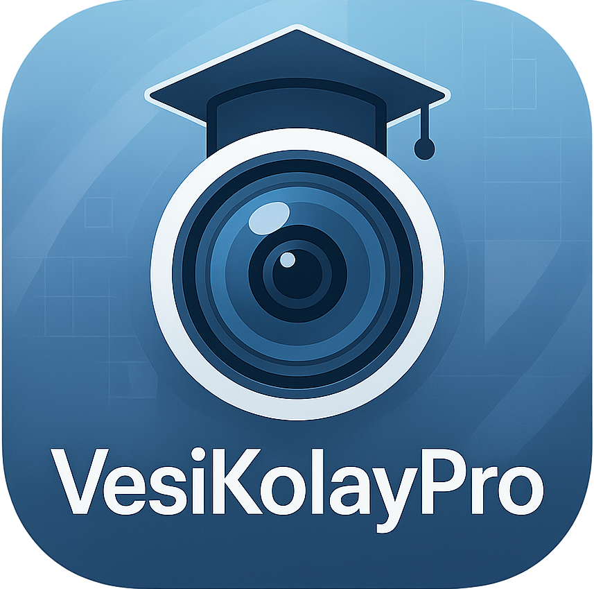

# 📸 VesiKolay Pro - Okul Fotoğrafçılığı Otomasyonu



> **Yeni Nesil Okul Fotoğrafçılığı Asistanı** - Excel verileri ile fotoğrafları otomatik eşleştiren, yeniden adlandıran ve profesyonel çıktılar üreten güçlü araç.

[](https://python.org)
[](LICENSE)
[]()

## 🌟 Öne Çıkan Özellikler

### 📋 **Excel Entegrasyonu**
- 📊 Esnek sütun yapısı - herhangi bir Excel formatını destekler
- 🔍 Akıllı sütun tanıma ve eşleştirme
- 📝 Çoklu sütun seçimi ve özel adlandırma deseni
- ✅ TC Kimlik doğrulama ve veri kontrolü

### 🖼️ **Gelişmiş Fotoğraf İşleme**
- 🤖 Otomatik yüz tanıma ve kırpma (OpenCV)
- ✂️ **E-Okul Uyumlu**: 35x45mm, max 150KB
- 🎓 **Açık Lise Uyumlu**: 394x512px, 400DPI, beyaz arka plan
- 📱 **MEBBIS Uyumlu**: Biyometrik standartlar
- 🆔 Vesikalık, pasaport, ehliyet boyutları
- 🎨 Özel boyut desteği (mm, cm, px)
- 🏷️ Watermark ekleme (metin/logo)

### 🆔 **Profesyonel Kimlik Kartı Sistemi**
- 🎨 Tamamen özelleştirilebilir tasarım
- 🌈 Gradient renk desteği (header/footer)
- 🖼️ Çift logo desteği (sol/sağ)
- 📱 QR kod entegrasyonu
- 📄 10 kart/sayfa optimizasyonu
- ✂️ Kesim kılavuzları

### 📄 **PDF Çıktıları**
- 📚 Sınıf bazında fotoğraf listeleri
- 🆔 Toplu kimlik kartı üretimi
- 📊 Görsel fotoğraf grid sistemi
- 🖨️ Yazdırma dostu tasarım

### 🗂️ **Akıllı Organizasyon**
- 📁 Otomatik klasör yapısı (Documents/VesiKolayPro)
- 🏫 Okul bazında dosya yönetimi
- 📅 Zaman damgalı yedekleme
- 🔄 Sınıf bazında fotoğraf organizasyonu

## 🚀 Hızlı Başlangıç

### 📋 Gereksinimler
- 🐍 Python 3.11+
- 💻 Windows, macOS veya Linux
- 📊 Excel dosyası (.xlsx/.xls)
- 📸 Fotoğraf klasörü (JPG/PNG)

### ⚡ Kurulum

1. **Repoyu klonlayın:**
```bash
git clone https://github.com/username/vesikolay-pro.git
cd vesikolay-pro
```

2. **Bağımlılıkları yükleyin:**
```bash
pip install -r requirements.txt
```

3. **Programı başlatın:**
```bash
python main.py
```

## 📖 Kullanım Kılavuzu

### 1️⃣ **Temel Kurulum**
1. 🏫 **Okul Adı**: Okulunuzun adını girin
2. 📅 **Eğitim-Öğretim Yılı**: Akademik yılı belirtin
3. 📊 **Excel Dosyası**: Öğrenci listesini seçin
4. 📂 **Fotoğraf Klasörü**: Fotoğrafların bulunduğu klasörü seçin

### 2️⃣ **Adlandırma Ayarları**
- 🔤 **Tek Sütun**: Sadece bir sütunu kullanın
- 🔗 **Çoklu Sütun**: Birden fazla sütunu birleştirin
- ⚙️ **Ayraç Seçimi**: `_`, `-`, boşluk veya `.`
- 📁 **Sınıf Organizasyonu**: Otomatik sınıf klasörleri

### 3️⃣ **Fotoğraf İşleme**
```
✂️ Boyutlandırma Seçenekleri:
├── 📱 E-Okul (35x45mm, max 150KB)
├── 🎓 Açık Lise (394x512px, 400DPI)
├── 💼 MEBBIS (394x512px, biyometrik)
├── 🆔 Vesikalık (45x60mm)
├── ✈️ Pasaport (35x35mm)
├── 🚗 Ehliyet (25x35mm)
└── ⚙️ Özel boyut
```

### 4️⃣ **İşlem Adımları**

1. **🔍 Kontrol Et**
   - Excel ve fotoğraf sayısını karşılaştır
   - Veri tutarlılığını kontrol et

2. **✨ Adlandır**
   - Fotoğrafları Excel verilerine göre yeniden adlandır
   - Sınıf bazında organize et

3. **✂️ Boyutlandır**
   - Fotoğrafları seçilen boyutlara kırp
   - Kalite optimizasyonu uygula

4. **📄 PDF Oluştur**
   - Sınıf listeleri
   - Fotoğraf gridleri

5. **🆔 Kimlik Kartı**
   - Profesyonel kimlik kartları
   - Toplu üretim

## 🎨 Kimlik Kartı Özelleştirme

### 🌈 **Renk Sistemi**
- 🎨 Header gradient desteği
- 🌈 Footer gradient desteği
- 🎯 Hex renk kodları (#RRGGBB)

### 🖼️ **Logo Sistemi**
- 📍 Sol logo (ana logo)
- 📍 Sağ logo (ikincil logo)
- 🔍 PNG saydamlık desteği
- 📐 Otomatik boyutlandırma

### 📱 **QR Kod**
- 📝 Özel metin
- 👤 Öğrenci bilgileri
- 📍 Pozisyon seçimi (sol/sağ alt)

### 📋 **Başlık Yapısı**
```
┌─────────────────────────────────────┐
│ [LOGO] T.C.                 [LOGO2] │ Header (renkli)
│        ANKARA VALİLİĞİ              │
│        OKUL ADI                     │
├─────────────────────────────────────┤
│ Öğrenci Kimlik Kartı               │ Başlık
├─────────────────────────────────────┤
│ [FOTOĞRAF] │ Adı: MEHMET           │ İçerik
│            │ Soyadı: YILMAZ        │
│            │ Sınıfı: 9-A           │
│            │ No: 123         [QR]  │
├─────────────────────────────────────┤
│ 2025-2026 EĞİTİM-ÖĞRETİM YILI     │ Footer (renkli)
└─────────────────────────────────────┘
```

## 🛠️ Gelişmiş Özellikler

### 🔧 **Toplu İşlemler**
- 📊 1000+ fotoğraf desteği
- ⚡ Çoklu thread işleme
- 🔄 İptal edilebilir işlemler
- 📈 Gerçek zamanlı ilerleme

### 🎯 **Akıllı Kırpma**
- 🤖 Yüz tanıma teknolojisi
- 📐 En-boy oranı korunması
- 🎨 Beyaz arka plan desteği
- 🔍 Kalite artırma

### 📁 **Dosya Yönetimi**
```
Documents/VesiKolayPro/
├── 📁 OKUL_ADI/
│   ├── 📁 20250115_143022/
│   │   ├── 📁 renamed/           # Adlandırılmış fotoğraflar
│   │   ├── 📁 e_okul_named/      # E-Okul boyutlu
│   │   ├── 📁 by_class/          # Sınıf klasörleri
│   │   ├── 📁 pdfs/              # PDF çıktıları
│   │   └── 📁 id_cards/          # Kimlik kartları
│   └── 📁 20250115_150000/
└── 📁 logs/                      # Sistem logları
```

## 📸 Desteklenen Formatlar

### 🖼️ **Giriş Formatları**
- 📷 JPG/JPEG (önerilen)
- 🖼️ PNG (destek var, JPG önerilir)
- 🖥️ BMP, TIFF, WebP

### 📤 **Çıkış Formatları**
- 📷 JPG (yüksek kalite)
- 📄 PDF (A4 optimizasyonu)

## ⚙️ Sistem Gereksinimleri

### 💻 **Donanım**
- 🧠 RAM: 4GB+ (önerilen 8GB)
- 💾 Disk: 2GB+ boş alan
- 🖥️ Ekran: 1024x768 minimum

### 📦 **Yazılım Bağımlılıkları**
```python
# Ana Kütüphaneler
pandas>=2.3.0          # Excel işleme
Pillow>=11.2.1          # Görüntü işleme
opencv-python>=4.11.0   # Yüz tanıma
fpdf2>=2.8.3           # PDF oluşturma
openpyxl>=3.1.5        # Excel okuma
customtkinter>=5.2.2   # Modern GUI
matplotlib>=3.10.3     # Grafik desteği
numpy>=2.3.0           # Matematiksel işlemler
```

## 🔧 Yapılandırma

### ⚙️ **config.py Ayarları**
```python
# Fotoğraf boyutları (mm)
PHOTO_SIZES = {
    'e_okul': (35, 45),        # E-Okul standardı
    'vesikalik': (45, 60),     # Vesikalık
    'passport': (35, 35),      # Pasaport
    'license': (25, 35)        # Ehliyet
}

# Maksimum dosya boyutları
MAX_FILE_SIZE = 50  # MB
MAX_PHOTOS_PER_BATCH = 1000
```

## 🚨 Sorun Giderme

### ❓ **Sık Karşılaşılan Sorunlar**

**🖼️ Fotoğraf Yüklenmiyor**
```
✅ Çözüm:
- Desteklenen formatı kontrol edin (JPG önerilir)
- Dosya boyutunu kontrol edin (<50MB)
- Dosya izinlerini kontrol edin
```

**📊 Excel Okunamıyor**
```
✅ Çözüm:
- .xlsx veya .xls formatında olduğundan emin olun
- Excel dosyasının açık olmadığından emin olun
- Dosya bozuk değil mi kontrol edin
```

**🤖 Yüz Tanınmıyor**
```
✅ Çözüm:
- Fotoğrafta yüzün net görünür olduğundan emin olun
- Işık koşullarını kontrol edin
- Manuel kırpma seçeneğini kullanın
```

### 📝 **Log Dosyaları**
```
Konum: Documents/VesiKolayPro/logs/vesikolay_pro.log
İçerik: Tüm işlem detayları ve hata mesajları
```

## 🤝 Katkıda Bulunma

### 🛠️ **Geliştirme Ortamı**
```bash
# Geliştirme modunda çalıştırma
python main.py

# Test verisi oluşturma
python -m tests.create_test_data

# Kod kalite kontrolü
pylint *.py
```

### 📋 **Katkı Kuralları**
1. 🍴 Fork yapın
2. 🌿 Feature branch oluşturun (`git checkout -b feature/yeni-ozellik`)
3. 💾 Commit yapın (`git commit -am 'Yeni özellik: ...'`)
4. 📤 Push yapın (`git push origin feature/yeni-ozellik`)
5. 🔄 Pull Request oluşturun

## 📄 Lisans

Bu proje MIT lisansı altında lisanslanmıştır. Detaylar için [LICENSE](LICENSE) dosyasına bakın.

## 👥 İletişim

- 📧 **E-posta**: [your-email@example.com](mailto:abdullahtat@gmail.com)
- 💬 **Issues**: [GitHub Issues](https://github.com/muallimun/VesiKolayPro/issues)
- 📖 **Dokümantasyon**: [Wiki](https://github.com/muallimun/VesiKolayPro/wiki)

## 🙏 Teşekkürler

- 🎨 **OpenCV Team** - Yüz tanıma teknolojisi
- 📊 **Pandas Team** - Excel işleme kütüphanesi
- 🖼️ **Pillow Team** - Görüntü işleme
- 📄 **fpdf2 Team** - PDF oluşturma

---

<div align="center">

**⭐ Proje beğendiyseniz yıldız vermeyi unutmayın! ⭐**

Made with ❤️ for Turkish Schools

</div>
